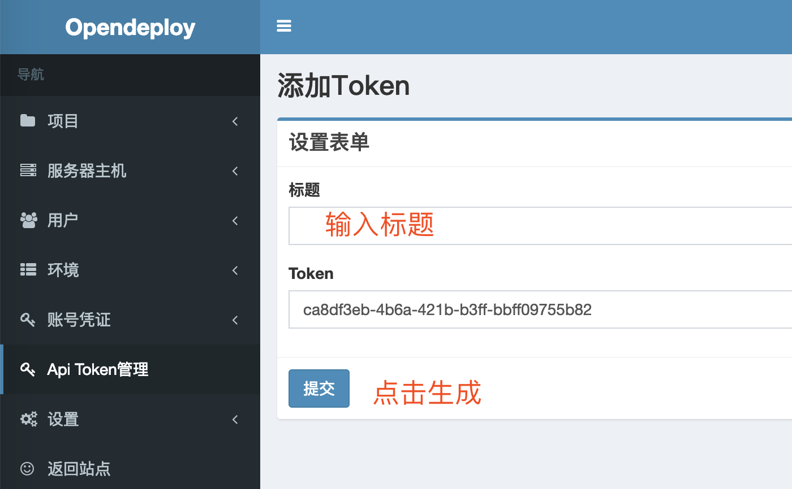
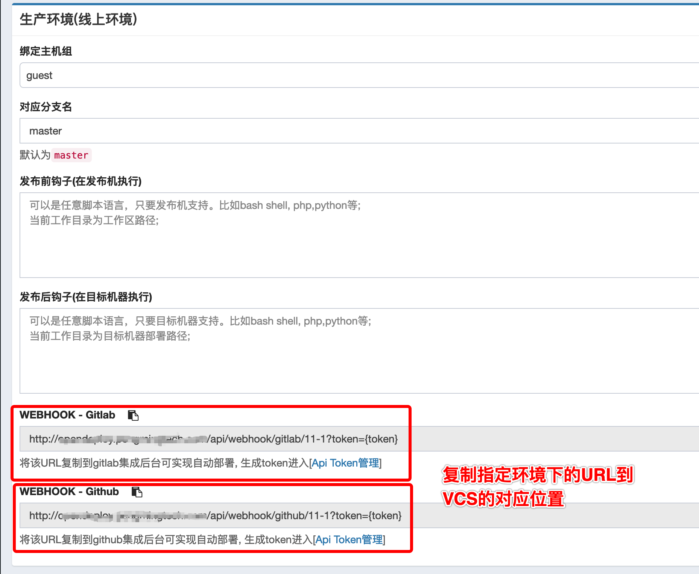
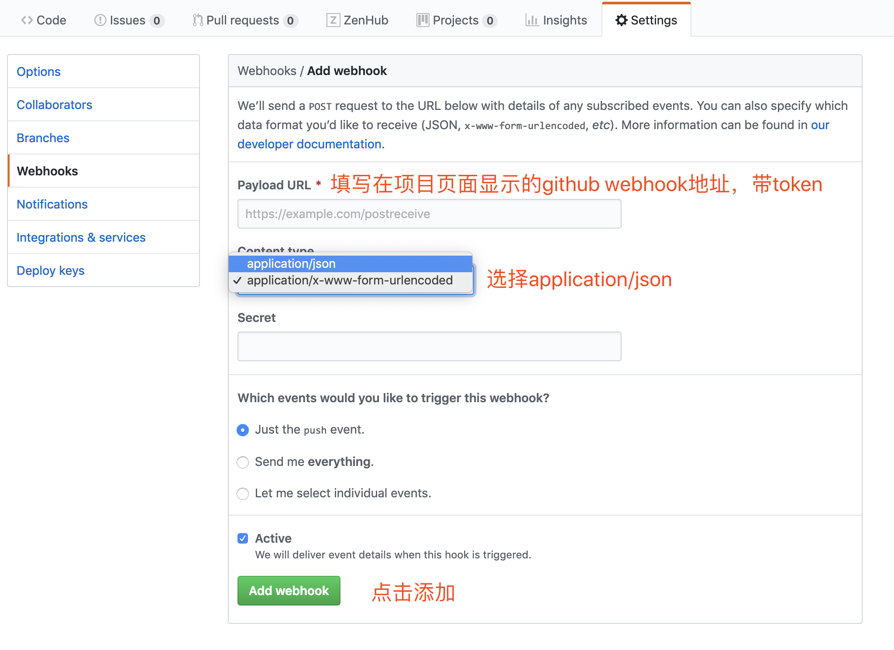
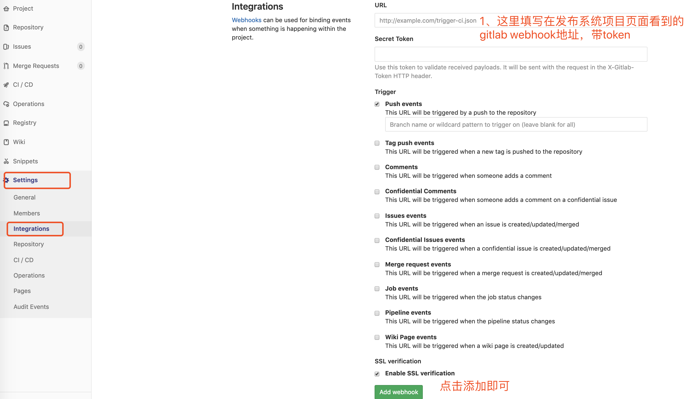

# Webhook
webhook是指github、gitlab等源代码管理系统支持的API。在一定动作触发时可以调用第三方服务。Opendeploy支持以下事件:

* Github支持push事件。
* Gitlab的push和merge两个事件。

## 在后台生成api token用于接口认证

## 在后台复制Opendeploy的API URL(token需要自己生成)

## github

## gitlab

